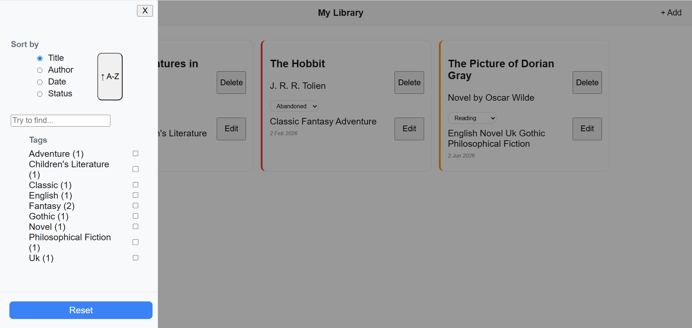
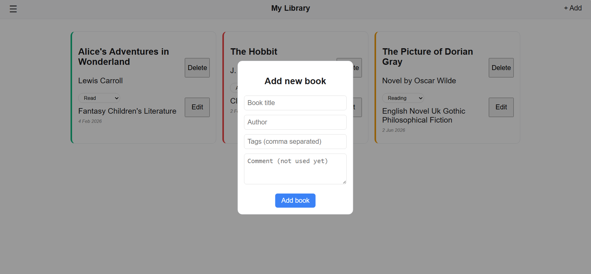

# 📚 My Library — Personal Book Tracking App

A full-featured React application for managing your personal book collection.  
Add, edit, delete, filter, sort, and search books — all with persistent local storage.

## ✨ Features

- **📖 Book Management**  
  Add new books, edit existing ones, and delete books you no longer need.

- **🏷️ Tag System**  
  Each book can have multiple tags (e.g., "fantasy", "classic").  
  Filter books by selecting one or more tags.

- **🔍 Search**  
  Real-time search by book title or author with debounced input.

- **📊 Sorting**  
  Sort books by:
  - Title (A–Z / Z–A)
  - Author
  - Status
  - Date added

- **📌 Reading Status**  
  Track each book as:
  - `Read`
  - `Reading`
  - `Abandoned`
  - **🎨 Sidebar Filters**  
    All filters (sorting, tags, search) are conveniently grouped in a collapsible sidebar.

- **💾 Persistent Storage**  
  Your library is automatically saved to `localStorage` — data survives page reloads.

- **➕ Modal Forms**  
  Clean modals for adding and editing books with overlay click-to-close.

## 🛠️ Tech Stack

- **React** (functional components + hooks)
- **TypeScript** (full type safety)
- **CSS Modules** (scoped styles via `.css` files)
- **LocalStorage** (client-side persistence)

## 🚀 Getting Started

## 1. Clone the repository

```bash
git clone https://github.com/Schtain/My-Library-App.git
cd my-library
```

## 2. Install dependencies

```bash
npm install
```

## 3. Run the development server

```bash
npm start
```

## 📁 Project Structure (key files)

```text
src/
├── App.tsx
├── Pages/
│   └── Home.tsx              # Main page with all state logic
├── Components/
│   ├── Header/               # Top bar with menu & add button
│   ├── Sidebar/              # Filters (sort, tags, search, reset)
│   ├── BookList/             # Renders list of BookCards
│   ├── BookCard/             # Single book view with status/edit/delete
│   ├── AddBookModal/         # Form for adding/editing books
│   ├── SearchBar/            # Debounced search input
│   └── Overlay/              # Closes modals/sidebar on outside click
├── hooks/
│   └── useDebounce.ts        # Custom debounce hook for search
└── styles/
    └── *.css                 # Component-scoped styles
```

## Screenshots




